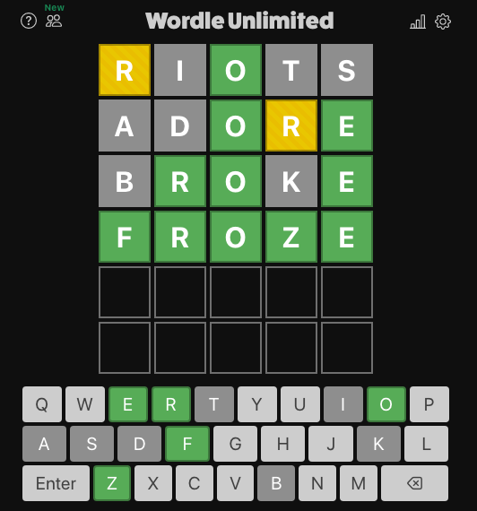

# Wordle for Emacs

A small program to help solve Wordle ()

As well as clones, for example: wordleunlimited.com) 

## Quick start

Load file in Emacs, evaluate entire buffer. 

Put a guess into Wordle, add guess + mask pair to list of guesses and masks, then evaluate wordle function (CTRL-e after wordle). In the results minibuffer, and also, in the Messages buffer, you will see a list of word candidates to continue playing.

## Example

    ; Example usage.
    (wordle
      '(

       "riots" "r.O.."
       "adore" "..OrE"
       "broke" ".RO.E"
     )
    )

In the above case, "riots" was the first guess and entered into Wordle. The letter r was yellow, i was grey, and o was green. t and s were also grey. 

And so it continues until you either guess correctly, or you run out of guesses:

## Notes

Though the current dictionary is for five letter words, not too many assumptions about word length are made. This could be extended to use other word sets with different lengths than five. In that case, pass that word set into w2 and set the wordle--word-length value to new value as needed.
