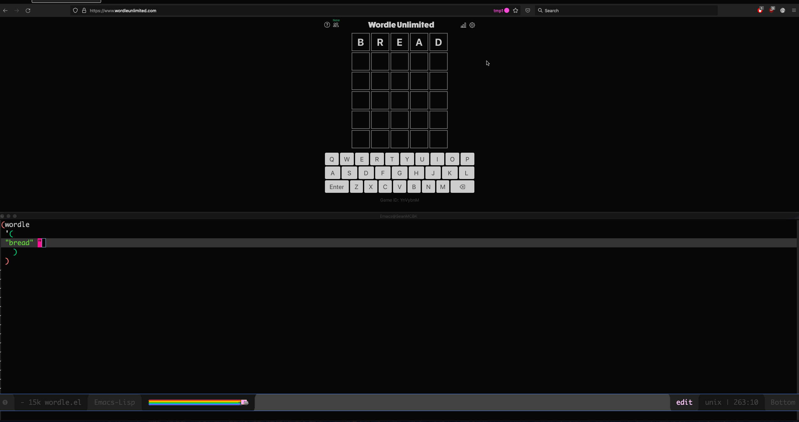

# Wordle for Emacs

A small program to help solve [Wordle](https://www.nytimes.com/games/wordle/index.html).

This can work just as well for Wordle clones, for example: [Wordle Unlimited](https://wordleunlimited.com).

## Quick start

Load file wordle.el in Emacs, then evaluate entire buffer. 

Put a guess into Wordle, add guess + mask pair to list of guesses and masks, then evaluate wordle function (CTRL-e after wordle). In the results minibuffer, and also, in the Messages buffer, you will see a list of word candidates to continue playing.

## Example

    ; Example usage.
    (wordle
      '(

       "riots" "r.O.."
       "adore" "..OrE"
       "broke" ".RO.E"
     )
    )

In the above case, "riots" was the first guess and entered into Wordle. The letter r was yellow, i was grey, and o was green. t and s were also grey. 

And so it continues until you either guess correctly, or you run out of guesses:

## See it in action

## Notes

To evaluate the entire buffer, the keybinding may vary (it's 'M-RET be' on Spacemacs), but it should be under the menu Emacs-Lisp->Evaluate Buffer.

To evaluate any expression, use C-x C-e (i.e., Ctrl-x Ctrl-e) right after the expression. So, if you add a word that was missing from the dictionary of words, put the cursor right after the parens that close (setq... , and before (wordle... and  then type Ctrl-x Ctrl-e to update the variable to include your new word(s).

### Extending
Though the current dictionary is for five letter words, not too many assumptions about word length are made. This could be extended to use other word sets with different lengths than five. In that case, pass that word set into w2 and set the wordle--word-length value to new value as needed.
